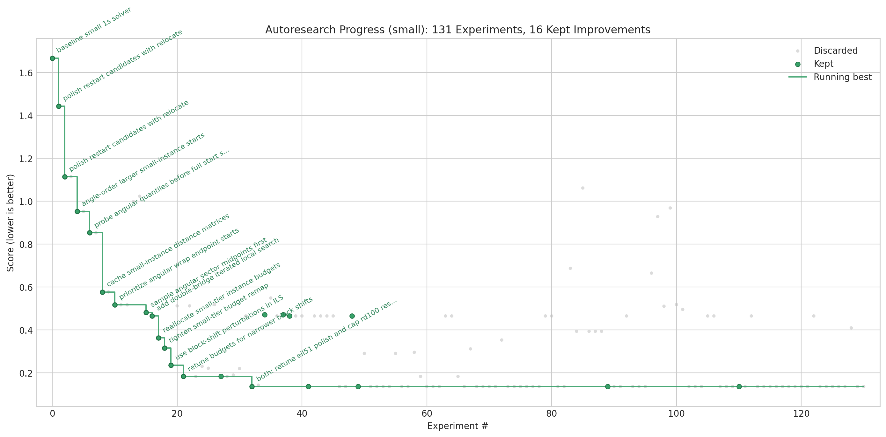
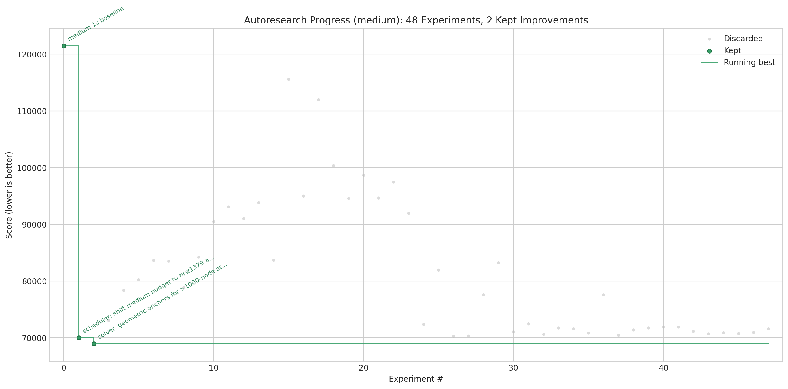

# autoresearch-or

This repository is inspired by [karpathy/autoresearch](https://github.com/karpathy/autoresearch). The basic idea is to let the agent improve a fixed benchmarked solver loop by editing `optimize.py`: for each benchmark instance, it can tune or rewrite the solver logic used for that instance, and it can also reallocate slices of a single total run budget across the instances in the tier to drive the aggregate score down. 

Three benchmark sizes are considered: small, medium, and large. The benchmark set is built from [TSPLIB95](https://www.or.uni-bonn.de/lectures/ws17/co_exercises/programming/tsp/tsp95.pdf) and the [University of Waterloo TSP data collection](https://www.math.uwaterloo.ca/tsp/data/). For small size the experiments found the optimal known tour in 4 out of 5 instances. Medium and large instances are still largely open work.

## Progress Plots

These plots come from `plot_results.ipynb` and summarize the experiment history.





## How It Works

The repository is deliberately small and only really has three files that matter for the experiment loop:

- `prepare.py` contains the fixed benchmark definitions, TSPLIB parsing, validation, scoring, result logging, and benchmark discovery utilities. I treat this as the stable harness and do not normally modify it.
- `optimize.py` is the single solver file the agent edits. It contains the solver presets, budget scheduler, local search operators, and run entrypoint. This is where architectural changes, heuristic changes, and budget-allocation changes happen.
- `program_TSP.md` is the baseline instruction file for one agent run. I edit this as the human to change the research objective, guardrails, or iteration policy.

By design, a benchmark run is evaluated under a fixed wall-clock budget per tier. In the current experiment history, I mostly use a 1-second total budget for small and medium runs. The scheduler inside `optimize.py` can then split that tier budget unevenly across instances, so harder or more score-sensitive cases get more time than easy ones. The metric is the aggregate score reported by the harness, where lower is better.

## Quick Start

Requirements: Python 3.11+ and git. No external services are required, and the benchmark data already lives in `data/tsp/`.

```bash
# 1. Inspect the available local benchmark tiers
python3 prepare.py --list

# 2. Run a single 1-second experiment on the small tier
python3 optimize.py --budget 1 --description "small baseline"

# 3. Run a medium-tier experiment
python3 optimize.py --size medium --budget 1 --seed 0 --description "medium baseline"

# 4. Inspect the most recent logged results
tail -n 20 results.tsv
```

If those commands work, the local setup is working and the repository is ready for iterative experiments.

## Running The Agent

Point your coding agent at `program_TSP.md` and let it iterate on `optimize.py`. A typical prompt is:

```text
Have a look at program_TSP.md and kick off a new experiment. Use 1 second solvers for small size benchmark.
```

The intended loop is simple: run the current solver, make one focused change, rerun the same benchmark tier, and keep or discard the change based on the logged score and artifact.

## Project Structure

```text
prepare.py       fixed benchmark harness, parsing, validation, scoring, logging
optimize.py      solver, scheduler, heuristics, and run entrypoint
program_TSP.md   agent instructions
pyproject.toml   project metadata
data/            local benchmark instances
results/         per-run JSON artifacts
results.tsv      aggregate experiment log
```


## Reproducing The Current Optimizers

The current medium optimizer lives in `optimize.py` on branch `autoresearch/2026-05-24-medium-1s`. The solver code for the best kept medium configuration is reproducible from optimizer commit `e8f4990` (which reverts a discarded `pcb442` attempt and leaves the best kept optimizer logic in place). Run:

```bash
git checkout e8f4990
python3 optimize.py --size medium --budget 1 --seed 0 --description "reproduce medium optimizer"
```

The latest validation at that commit reported aggregate score `51139.368318` in `1.012s`. Due to strict wall-clock cutoffs, small run-to-run variation is expected; the best logged equivalent-code run before the discard/revert sequence was `51092.771228` at commit `bab181d`.

The current medium optimizer changes are intentionally contained in `optimize.py`:

- an explicit medium scheduler, weighted toward raw-objective instances that dominate the harness score
- sweep construction for `rat783` and `pcb3038` with tuned bucket sizes
- preferred nearest-neighbor starts for `lin318`, `nrw1379`, and `pr1002`

## Benchmark Tiers

The benchmark set is split into `small`, `medium`, and `large`. All instances are loaded from the local `data/tsp/` folder.

| Size | Instance | Nodes | Edge Type | Optimal Tour Known | Metric Harness Gap To Known Optimum | Current 1s Harness Cost | Harness Commit | Data File |
| --- | --- | ---: | --- | --- | ---: | ---: | --- | --- |
| small | att48 | 48 | ATT | yes | pending on current medium branch | pending | pending | `data/tsp/tsplib/att48.tsp` |
| small | eil51 | 51 | EUC_2D | yes | pending on current medium branch | pending | pending | `data/tsp/tsplib/eil51.tsp` |
| small | berlin52 | 52 | EUC_2D | yes | pending on current medium branch | pending | pending | `data/tsp/tsplib/berlin52.tsp` |
| small | pr76 | 76 | EUC_2D | yes | pending on current medium branch | pending | pending | `data/tsp/tsplib/pr76.tsp` |
| small | rd100 | 100 | EUC_2D | yes | pending on current medium branch | pending | pending | `data/tsp/tsplib/rd100.tsp` |
| medium | lin318 | 318 | EUC_2D | no | n/a | 49411.00 | `e8f4990` | `data/tsp/tsplib/lin318.tsp` |
| medium | pcb442 | 442 | EUC_2D | yes | 195.206586% | 195.206586 | `e8f4990` | `data/tsp/tsplib/pcb442.tsp` |
| medium | rat783 | 783 | EUC_2D | no | n/a | 11146.00 | `e8f4990` | `data/tsp/tsplib/rat783.tsp` |
| medium | pr1002 | 1002 | EUC_2D | yes | 32.003320% | 32.003320 | `e8f4990` | `data/tsp/tsplib/pr1002.tsp` |
| medium | nrw1379 | 1379 | EUC_2D | no | n/a | 68633.00 | `e8f4990` | `data/tsp/tsplib/nrw1379.tsp` |
| medium | pcb3038 | 3038 | EUC_2D | no | n/a | 177419.00 | `e8f4990` | `data/tsp/tsplib/pcb3038.tsp` |
| large | qa194 | 194 | EUC_2D | no | n/a | pending | pending | `data/tsp/waterloo/qa194.tsp` |
| large | uy734 | 734 | EUC_2D | no | n/a | pending | pending | `data/tsp/waterloo/uy734.tsp` |
| large | lu980 | 980 | EUC_2D | no | n/a | pending | pending | `data/tsp/waterloo/lu980.tsp` |
| large | gr9882 | 9882 | EUC_2D | no | n/a | pending | pending | `data/tsp/waterloo/gr9882.tsp` |
| large | ch71009 | 71009 | EUC_2D | no | n/a | pending | pending | `data/tsp/waterloo/ch71009.tsp` |
| large | world | 1904711 | GEOM | no | n/a | pending | pending | `data/tsp/waterloo/world.tsp` |
