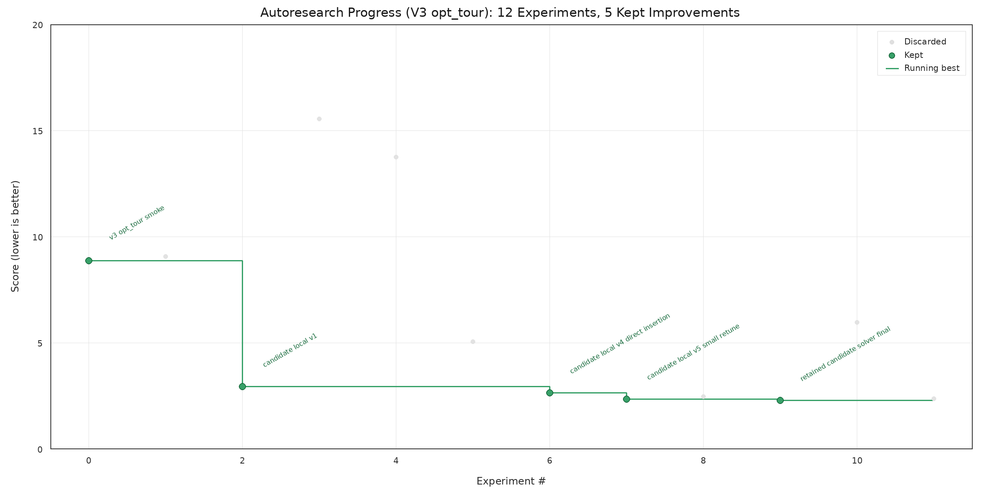
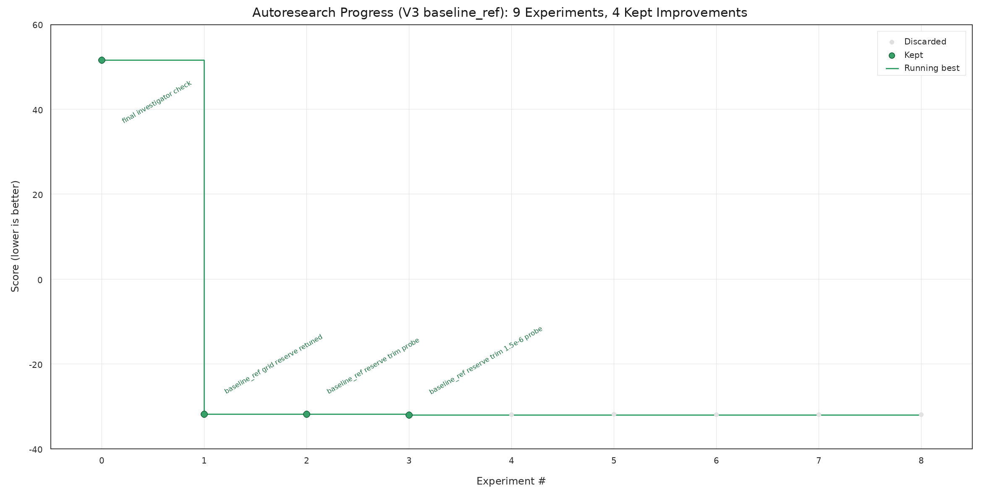

# autoresearch-or

This repository is inspired by [karpathy/autoresearch](https://github.com/karpathy/autoresearch). The basic idea is to let the agent improve a fixed benchmarked solver loop by editing `optimize.py`: it can tune or rewrite the solver logic, assign benchmark-specific solvers, and reallocate slices of a single total run budget across the instances in the tier to drive the aggregate score down.

Three benchmark sizes are considered: small, medium, and large. The benchmark set is built from [TSPLIB95](https://www.or.uni-bonn.de/lectures/ws17/co_exercises/programming/tsp/tsp95.pdf) and the [University of Waterloo TSP data collection](https://www.math.uwaterloo.ca/tsp/data/). V3 scoring uses a fixed normalized reference objective for every instance, and adds an independent `--suite` filter so known-optimum `.opt.tour` instances can be tracked separately from baseline-reference instances.

## How It Works

The repository is deliberately small and only really has three files that matter for the experiment loop:

- `prepare.py` contains the fixed V3 benchmark definitions, TSPLIB parsing, sanitized solver inputs, validation, normalized scoring, timeout enforcement, result logging, and benchmark discovery utilities. I treat this as the stable harness and do not normally modify it after a harness version is set.
- `optimize.py` is the single solver file the agent edits. It contains the solver presets, budget scheduler, solver registry, local search operators, and run entrypoint. This is where architectural changes, heuristic changes, and budget-allocation changes happen.
- `program_TSP.md` is the baseline instruction file for one agent run. I edit this as the human to change the research objective, guardrails, or iteration policy.

By design, a benchmark run is evaluated under a fixed wall-clock budget for the selected size/suite. The V3 harness passes sanitized public `TSPInstance` objects to `optimize.py`, keeps reference objectives private to scoring, and enforces the total benchmark deadline. The scheduler inside `optimize.py` splits the selected run budget unevenly across instances. The metric is `relative_gap_pct_v3`, the mean percent gap against fixed per-instance references; lower is better. V3 artifacts also report separate aggregate scores for `opt_tour` and `baseline_sweep_v1` references when both are present.

## Quick Start

Requirements: Python 3.11+ and git. No external services are required, and the benchmark data already lives in `data/tsp/`.

```bash
# 1. Inspect the available local benchmark tiers
python3 prepare.py --list

# 2. Run a single 1-second experiment on the small tier
python3 optimize.py --budget 1 --description "small baseline"

# 3. Run a medium-tier experiment
python3 optimize.py --size medium --budget 1 --seed 0 --description "medium baseline"

# 4. Run the cross-size known-optimum suite
python3 optimize.py --suite opt_tour --budget 1 --seed 0 --description "known optimum suite"

# 5. Inspect the most recent logged results
tail -n 20 results_v3.tsv
```

If those commands work, the local setup is working and the repository is ready for iterative experiments.

## Running The Agent

Point your coding agent at `program_TSP.md` and let it iterate on `optimize.py`. A typical prompt is:

```text
Have a look at program_TSP.md and kick off a new experiment. Use 1 second solvers for small size benchmark.
```

The intended loop is simple: run the current solver, make one focused change, rerun the same benchmark tier, and keep or discard the change based on the logged score and artifact.

## Project Structure

```text
prepare.py       fixed benchmark harness, parsing, validation, scoring, logging
optimize.py      solver, scheduler, heuristics, and run entrypoint
program_TSP.md   agent instructions
pyproject.toml   project metadata
data/            local benchmark instances
results_v2/      legacy V2 per-run JSON artifacts
results_v2.tsv   legacy V2 aggregate experiment log
results_v3/      V3 per-run JSON artifacts
results_v3.tsv   V3 aggregate experiment log
```

## V3 Progress

V3 separates known-optimum `.opt.tour` instances from baseline-reference instances. A score of `0.0` on `opt_tour` means the solver matched the known tour objective. Negative `baseline_ref` scores mean the solver beat the committed sweep baseline, not that it proved global optimality.

The plots below follow the original `karpathy/autoresearch` progress-chart format: gray points are discarded attempts, green points are kept score improvements, and the green step line is the running best score.





## Benchmark Tiers

The benchmark set is split into `small`, `medium`, and `large`, and V3 also supports reference suites with `--suite opt_tour` and `--suite baseline_ref`. These suite filters are independent of size: use `--suite opt_tour` for all known-optimum instances, or combine filters such as `--size medium --suite opt_tour`. All instances are loaded from the local `data/tsp/` folder. `opt_tour` references come from local `.opt.tour` files; `baseline_sweep_v1` references are committed harness constants generated by the deterministic sweep baseline.

| Size | Instance | Nodes | Edge Type | V3 Reference | Data File |
| --- | --- | ---: | --- | --- | --- |
| small | att48 | 48 | ATT | opt_tour: 10628 | `data/tsp/tsplib/att48.tsp` |
| small | eil51 | 51 | EUC_2D | opt_tour: 426 | `data/tsp/tsplib/eil51.tsp` |
| small | berlin52 | 52 | EUC_2D | opt_tour: 7542 | `data/tsp/tsplib/berlin52.tsp` |
| small | pr76 | 76 | EUC_2D | opt_tour: 108159 | `data/tsp/tsplib/pr76.tsp` |
| small | rd100 | 100 | EUC_2D | opt_tour: 7910 | `data/tsp/tsplib/rd100.tsp` |
| medium | lin318 | 318 | EUC_2D | baseline_sweep_v1: 68360 | `data/tsp/tsplib/lin318.tsp` |
| medium | pcb442 | 442 | EUC_2D | opt_tour: 50778 | `data/tsp/tsplib/pcb442.tsp` |
| medium | rat783 | 783 | EUC_2D | baseline_sweep_v1: 15299 | `data/tsp/tsplib/rat783.tsp` |
| medium | pr1002 | 1002 | EUC_2D | opt_tour: 259045 | `data/tsp/tsplib/pr1002.tsp` |
| medium | nrw1379 | 1379 | EUC_2D | baseline_sweep_v1: 79914 | `data/tsp/tsplib/nrw1379.tsp` |
| medium | pcb3038 | 3038 | EUC_2D | baseline_sweep_v1: 231633 | `data/tsp/tsplib/pcb3038.tsp` |
| large | qa194 | 194 | EUC_2D | baseline_sweep_v1: 16342 | `data/tsp/waterloo/qa194.tsp` |
| large | uy734 | 734 | EUC_2D | baseline_sweep_v1: 122837 | `data/tsp/waterloo/uy734.tsp` |
| large | lu980 | 980 | EUC_2D | baseline_sweep_v1: 19338 | `data/tsp/waterloo/lu980.tsp` |
| large | gr9882 | 9882 | EUC_2D | baseline_sweep_v1: 603290 | `data/tsp/waterloo/gr9882.tsp` |
| large | ch71009 | 71009 | EUC_2D | baseline_sweep_v1: 11757850 | `data/tsp/waterloo/ch71009.tsp` |
| large | world | 1904711 | GEOM | baseline_sweep_v1: 35917135 | `data/tsp/waterloo/world.tsp` |
